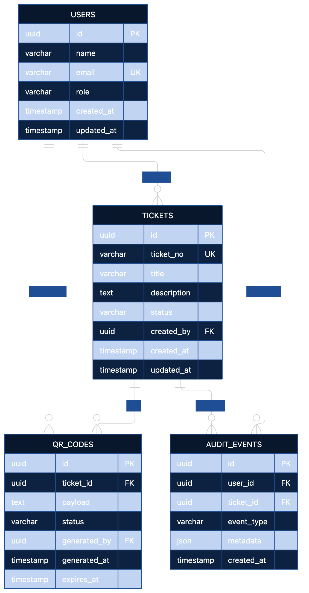

# Ticket QR Code Generator Worker

A digital worker application designed to simplify ticket QR-code generation and management while providing reliable validation, accessibility, security, and error handling.

## Overview

The project replaces manual ticket QR-code workflows with a structured digital system.

The architecture is designed around:

* Ticket management
* QR-code generation
* QR-code lifecycle management
* Input validation
* Empty-state handling
* Loading-state handling
* Connectivity/error handling
* Accessibility
* Input sanitization
* Simulated telemetry
* Auditability

## Current Project Stage

The current stage focuses on **architecture and test-driven planning before feature implementation**.

### Completed

* Database schema
* Entity Relationship Diagram
* ERD PNG
* REST API contracts
* TDD acceptance criteria
* AI-assisted engineering prompt log

### Planned

* Backend API implementation
* Database implementation
* QR-code generation
* Frontend worker interface
* Automated executable tests
* Accessibility verification
* Security verification
* Browser testing
* Production deployment

## Project Structure

```text
ticket-qr-code-generator-worker/
│
├── docs/
│   ├── database-schema.md
│   ├── erd.md
│   ├── erd.png
│   └── api-contracts.md
│
├── tests/
│   └── acceptance-criteria.md
│
├── PROMPTS.md
└── README.md
```

## Architecture

The planned data model contains four primary entities:

### Users

Stores application users and their roles.

### Tickets

Stores ticket information, status, and ownership.

### QR Codes

Stores QR-code payloads and lifecycle information associated with tickets.

### Audit Events

Records important system actions for traceability.

## Database ERD



The editable Mermaid version of the ERD is available in [`docs/erd.md`](docs/erd.md).

## API

The planned REST API provides operations for:

* Creating tickets
* Retrieving tickets
* Updating tickets
* Generating QR codes
* Retrieving QR codes
* Revoking QR codes
* Retrieving audit events

Detailed request and response contracts are documented in [`docs/api-contracts.md`](docs/api-contracts.md).

## Testing Strategy

The project follows a test-driven development workflow.

Acceptance criteria are documented before implementation and cover:

* Valid and invalid inputs
* Empty states
* Loading states
* Connectivity failures
* QR-code generation
* Duplicate submissions
* Input sanitization
* Telemetry
* Accessibility
* Keyboard navigation
* API error handling

See [`tests/acceptance-criteria.md`](tests/acceptance-criteria.md).

## Security

The planned implementation will:

* Validate incoming data
* Sanitize user-controlled text
* Prevent unsafe content from being executed
* Avoid hardcoded secrets
* Apply appropriate authentication and authorization
* Avoid unnecessary sensitive information in QR payloads
* Apply rate limiting to appropriate endpoints
* Avoid exposing sensitive information through telemetry

## Accessibility

The interface is designed to target a 100% Lighthouse accessibility score.

Planned accessibility requirements include:

* Accessible names for interactive elements
* Proper form labels
* Keyboard navigation
* Visible interaction states
* Clear validation feedback
* Accessible loading and error states

## Error Handling

The application must remain usable when operations fail.

Expected scenarios include:

* Invalid form input
* Empty API responses
* Slow network requests
* Temporary service unavailability
* Invalid API responses
* Missing resources
* Duplicate submissions

Loading indicators and user-friendly error messages will be provided for asynchronous operations.

## Telemetry

The application includes a simulated analytics event for primary actions:

```text
[Analytics] User interacted with Ticket QR Code Generator Worker
```

Telemetry must not expose sensitive user or ticket information.

## AI-Assisted Development

This project follows an AI-assisted engineering workflow.

AI is used to assist with:

* Requirements analysis
* Architecture planning
* Database design
* API design
* Test planning
* Implementation
* Debugging

Engineering decisions and significant prompts are documented in [`PROMPTS.md`](PROMPTS.md).

## Documentation

| Document                                                       | Purpose                                          |
| -------------------------------------------------------------- | ------------------------------------------------ |
| [`docs/database-schema.md`](docs/database-schema.md)           | Database entities, fields, keys, and constraints |
| [`docs/erd.md`](docs/erd.md)                                   | Editable Mermaid ERD                             |
| [`docs/erd.png`](docs/erd.png)                                 | Visual ERD                                       |
| [`docs/api-contracts.md`](docs/api-contracts.md)               | REST API request/response contracts              |
| [`tests/acceptance-criteria.md`](tests/acceptance-criteria.md) | TDD acceptance criteria                          |
| [`PROMPTS.md`](PROMPTS.md)                                     | AI-assisted development prompt log               |

## Development Status

**Architecture and planning phase**

Implementation will begin only after the documented architecture and acceptance criteria have been reviewed.

## License

This project is intended for educational and professional development purposes.
